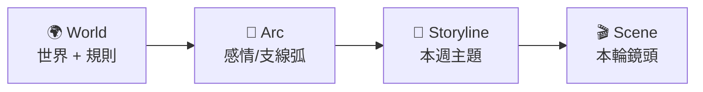

> **Example proposal — Full size.** Shows the shape of a Full proposal (cross-multi-module,
> effort=L, confidence=medium). Real proposals will be ~600-1200 lines; this example is
> ~250 lines to keep the skill examples lean. Use this as a structural reference, not a
> word-count target.

## 給未來 Claude (我自己 3 個月後)
> R-001「故事生成」是 ai-eden 從「角色亂聊」升級成「角色帶你走一段感情故事」的支點。
> 這份 proposal 把方向釘在「World → Arc → Storyline → Scene 四層 pipeline」,而不是
> 直接擴充現有 storyline DSL,理由在 §4。

## §1 目標

- **一句話:** 把現有 storyline (chapter+flag) 升級成 4 層敘事 pipeline,讓劇情有節奏感、不重複、跨角色可複用。
- **為什麼是現在:** Architecture overview Imp 3 已標 dialogue.py / storyline 是熱點;再加新 chapter 直接擴 chapter 不是長期解。
- **怎樣算成功:**
  - 同一個 character 跑兩個不同 user 路徑,選到的場景不重疊度 ≥ 70%
  - 策劃寫第二個 character 的時間 ≤ 第一個的 50%
  - User 在 5 個 session 後仍有 ≥ 1 個「沒看過的場景」可能性

## §2 現狀 (引用 Architecture)

- 當前 storyline 是「平鋪 chapter + flag DSL」,參見 [[Architecture/ai-flows/storyline]]。每章 `advance_when` 判斷推進,沒有「主題容器」「場景變化」概念。
- 限制:
  - 無 Arc/Scene 概念 → 同一個情境(吵架 / 生日 / 雨夜)只有一種演法
  - DSL 無括號(已知限制 L-001) → 複雜推進條件要拆 chapter
  - 跨角色複用為零 → 每個 character 全部手刻

## §3 提案 (prescriptive)

**4 層分工:**
- World (跨 character 共用) — 既有 `world.yaml`,基本不變
- Arc (per character) — 新層,track 「人生階段」(陌生→朋友→曖昧→戀人 + 支線)
- Storyline (Arc 內,部分可跨 Arc 套模板) — 新層,track「本週主題」
- Scene (Storyline 內) — 取代「平鋪 chapter」,每輪選一個塞進 narrator prompt

**影響面:**
- [[Architecture/modules/app-characters]] schema:新增 `Arc` / `Storyline` / `Scene` dataclass
- [[Architecture/modules/app-services]] storyline.py:重構 selection pipeline
- [[Architecture/modules/app-services]] dialogue.py:`_compose_system_prompt` 多 1 段 Scene-injection
- [[Architecture/modules/app-tools]] expand_storyline.py:Stage A 改產出 Arc + Storyline + Scene 三層 sidecar

## §3.x Self-FAQ

> 由 ce-adversarial-document-reviewer 挑問題,作者本人作答。

### Q1: Arc 跟 Intimacy 不是同一個東西嗎?
**答:** 不是。Intimacy 是 scalar (1-10),never-decrease;Arc 是 narrative state with start/middle/end + 可分支可並行可重入。詳見比喻表 + 4 個 intimacy 替代不了 Arc 的理由(同 reference doc §3.5)。

### Q2: 為什麼不只擴展現有 chapter+flag?
**答:** chapter 平鋪同時承擔「人生階段」+「本週主題」兩種職責,擴展只會讓 chapter 數量爆炸(5 階段 × 10 主題 = 50 chapter)。Arc/Storyline 拆責任後 = 5 Arc + 10 Storyline = 15 個。

### Q3: 4 層會不會 over-engineering,3 層就好?
**答:** 算過了。3 層(World → Chapter → Scene)Chapter 仍要兼職兩種,5×10=50;4 層 5+10=15,省 70% 策劃工。多一層 LifeStage 才是 over-engineering(單一時間軸用不到)。

### Q4: Storyline 跟 Scene 怎麼分?
**答:** Storyline = 跨多 turn 的「主題」(如「生日週」一週 7 天 active),Scene = 1-5 turn 的「鏡頭」。一條 Storyline 裝多個 Scene。Scene 是 narrator 唯一看到的具體內容。

### Q5: hot path 會不會回歸 TTFB?
**答:** 不會。Arc/Storyline/Scene 選擇全是規則層(intimacy + flag + time + cooldown),零 LLM。Narrator 是唯一 hot-path LLM,跟現在一樣。

## §4 取捨 / 為什麼不選別的

| 選項 | 為什麼不選 |
|---|---|
| A · 擴 chapter+flag DSL | chapter 數量爆炸,且 DSL 無括號(L-001)是同樣痛點 |
| B · 全部交給 narrator 自己決定下一步 | narrator 沒有跨 turn 記憶,容易在原地打轉(現狀 issue) |
| C · 三層 (World→Chapter→Scene) | chapter 兼職兩種職責,工作量 3× |
| **D · 4 層 (本提案)** | sweet spot — 抽出 Arc 解掉 chapter 過載,Scene 解掉重複問題 |

**刻意不做 (scope guard):**
- 不做 GUI authoring CMS(在 R-???);本 proposal 只到 schema + runtime
- 不做 A/B test 框架(在 R-???);先讓 4 層 work
- 不做 episodic memory(在 R-??? 或 R-006 延伸);本 proposal 不碰 Memory 層

## §5 高層實作

| Phase | 內容 | 時程 | Kill switch |
|---|---|---|---|
| 1 | Schema (Arc/Storyline/Scene dataclass + YAML loader) | 3 天 | `EDEN_FOUR_LAYER_ENABLED=false` |
| 2 | Arc engine (規則層 + per-session state) + 後端 API | 3 天 | 同上 |
| 3 | Storyline selector + Scene engine | 5 天 | 同上 |
| 4 | StateInference 擴充:consumed_scenes 推斷 | 3 天 | `EDEN_SCENE_INFERENCE_ENABLED=false` |
| 5 | expand_storyline Stage A 升級 | 5 天 | 工具 only,不影響 runtime |
| 6 | 跑現有 5 個 world 的 migration | 3 天 | 可分批 ship |

**總計:** 22 天。每 phase 結尾 ship 一次,kill switch 走 settings。

## §6 觀測 / 上線後怎麼知道對不對

| 指標 | 目標 |
|---|---|
| Scene 觸發率 distribution | 80% Scene 至少被觸發 1 次 / 7 天 |
| 同 character 不同 user 的 Scene 重疊度 | ≤ 30% |
| Arc 完成率 (per character) | ≥ 60% user 走到「朋友→曖昧」 |
| TTFB P95 | 不回歸(現在 ~400ms baseline) |
| State inference timeout rate | ≤ 1% (目前 silent stall 風險點) |

退場條件:Phase 3 ship 後 7 天內若 Scene 觸發率 < 30% → rollback `EDEN_FOUR_LAYER_ENABLED=false`,重看 selection 規則。

## §7 開放問題

- Storyline cooldown 用 turn-based 還是 wallclock-based?(影響「生日週」的「週」定義)
- Scene `body_template` 跟 character `speaking_style` 衝突時誰贏?(暫定 character 強)
- Arc / Storyline / Scene 的 ID space 怎麼跟既有 chapter ID 共存或 migrate?

## §8 Cross-links

- ↑ Roadmap: [[ROADMAP]] §R-001
- ← Sources (見 frontmatter):上述 Architecture 節點 + Research 結果
- ⇆ 相關 proposal (sibling): 若做 runtime EventBus 改造,寫一份 `R-???-eventbus-continuity-proposal.md`
- → 衍生 ADR 候選:
  - ADR: World → Arc → Storyline → Scene 4 層敘事架構 (TODO)
  - ADR: Arc 永不刪除(state machine pending → active → completed/failed) (TODO)
